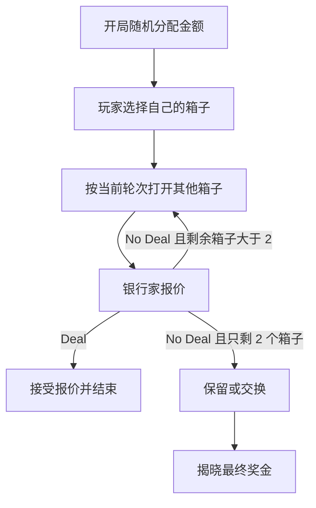

# 26 Boxes 游戏策划文档

## 1. 项目概述

《26 Boxes》是一款单人网页决策游戏。系统在开局时将 26 个不同金额随机放入 26 个编号箱子中，玩家先选择一个箱子作为自己的箱子，随后逐轮打开其他箱子，并在每轮结束后面对银行家的现金报价。玩家需要在“立即拿钱”和“继续承担不确定性”之间做选择。

## 2. 核心体验目标

- 紧张感：每次开箱都会改变剩余金额池，玩家可以直观看到高额奖金是否仍在场。
- 决策感：银行报价不是单纯提示，而是让玩家持续权衡风险和期望收益。
- 可读性：玩家始终能看清当前轮次、还需打开的箱子数量、剩余最高金额和历史报价。
- 快节奏：全局无需注册、无需加载关卡，进入页面即可开局。

## 3. 游戏规则

1. 开局时系统将 26 个金额随机放入 26 个编号箱子。
2. 玩家选择 1 个箱子作为自己的箱子，该箱子不会立即打开。
3. 玩家按回合打开其他箱子：
   - 第 1 轮打开 6 个。
   - 第 2 轮打开 5 个。
   - 第 3 轮打开 4 个。
   - 第 4 轮打开 3 个。
   - 第 5 轮打开 2 个。
   - 之后每轮打开 1 个。
4. 每轮结束后，银行家根据剩余金额给出报价。
5. 玩家可以选择 Deal 接受报价并结束游戏。
6. 玩家也可以选择 No Deal 继续开箱。
7. 当只剩玩家自己的箱子和最后 1 个未打开箱子时，银行家给出最后报价。
8. 若玩家继续 No Deal，则进入最终选择：保留自己的箱子或交换最后一个箱子。
9. 玩家获得最终持有箱子中的金额。

## 4. 金额配置

当前版本使用 26 个人民币金额，覆盖低额安慰奖到高额大奖：

`¥1, ¥5, ¥10, ¥50, ¥100, ¥200, ¥300, ¥500, ¥750, ¥1,000, ¥2,500, ¥5,000, ¥7,500, ¥10,000, ¥25,000, ¥50,000, ¥75,000, ¥100,000, ¥150,000, ¥250,000, ¥400,000, ¥600,000, ¥800,000, ¥1,000,000, ¥1,500,000, ¥2,000,000`

金额表可以在 `src/game-engine.js` 的 `MONEY_AMOUNTS` 中集中调整。

## 5. 银行家报价机制

报价以“剩余金额期望值”为基础，并根据游戏进度逐步接近真实期望值：

- 前期报价偏保守，鼓励玩家继续。
- 中期报价接近风险折中值。
- 后期报价更接近期望值，形成高压决策。
- 若高额金额仍然较多，报价会获得小幅溢价。
- 报价会四舍五入到更像真实节目报价的整值。

该机制不是模拟完美经济模型，而是服务于单人网页游戏的节奏和戏剧性。

## 6. 用户界面

主界面分为三块：

- 开箱区：展示 26 个编号箱子，负责选择玩家箱子和逐轮开箱。
- 操作区：展示玩家箱子、银行报价、最终选择、游戏结果和报价历史。
- 金额板：展示所有可能金额，已开出的金额会变暗并划除。

界面应优先呈现可执行操作，不提供冗长的新手教程。玩家通过当前阶段文案和可点击状态理解下一步。

## 7. 状态流程

## 8. 胜负与结算

游戏不设置传统胜负，只记录玩家最终获得金额：

- Deal 结算：玩家获得银行报价。
- 最终箱子结算：玩家获得保留或交换后持有箱子的金额。

结果页会显示获得金额，并在接受报价时展示玩家原箱金额，方便玩家复盘。

## 9. 后续扩展

- 难度模式：调整金额池和报价保守程度。
- 战绩统计：记录最高奖金、平均 Deal 轮次和换箱成功率。
- 音效与动画：增强开箱、来电报价、最终揭晓的反馈。
- 多语言：把界面文案抽离为语言包。
- 可配置局：允许玩家自定义金额池和箱子数量。
