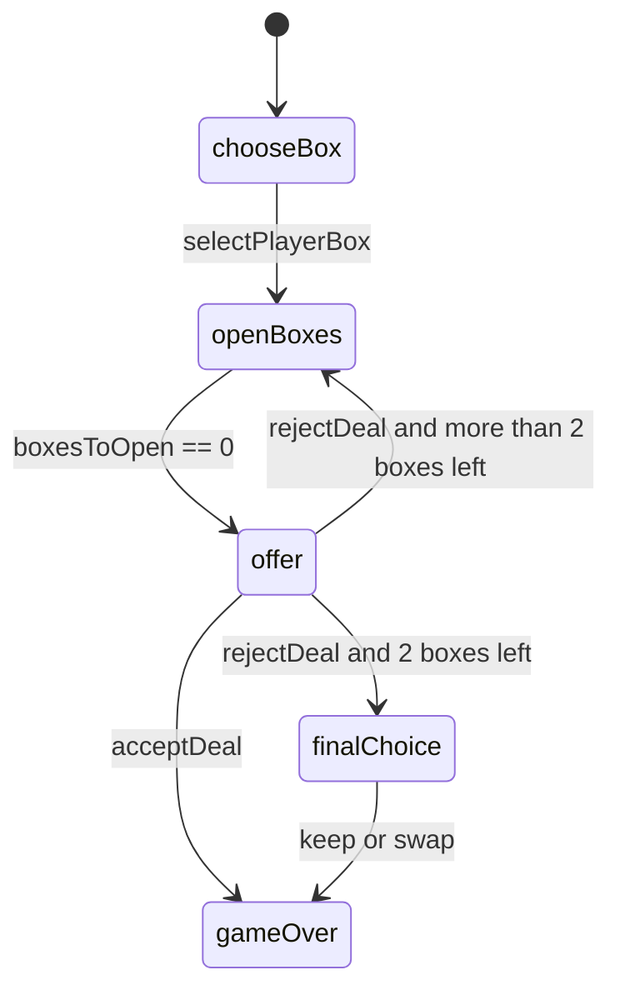

# 26 Boxes 软件架构设计说明

## 1. 架构目标

本项目采用零依赖静态网页架构，目标是让游戏可以直接通过浏览器运行，同时保持规则逻辑可测试、可维护、可迁移。

核心目标：

- 规则与界面分离。
- 主要状态变化可由纯函数驱动。
- 不依赖构建工具即可运行。
- 保留自动化测试入口，方便后续接入 CI。
- 目录结构清晰，便于 Git 和 GitHub 协作。

## 2. 技术栈

- HTML：页面结构。
- CSS：响应式布局、箱子视觉、金额板和状态面板。
- JavaScript ES Modules：游戏引擎和浏览器交互。
- Node.js：本地静态服务器和测试运行。
- Git：本地版本管理。
- GitHub：远端仓库、分支协作和发布管理。

## 3. 目录结构

```text
.
├── docs/
│   ├── game-design.md
│   └── software-architecture.md
├── scripts/
│   └── static-server.mjs
├── src/
│   ├── app.js
│   └── game-engine.js
├── tests/
│   └── game-engine.test.mjs
├── index.html
├── styles.css
├── package.json
└── README.md
```

## 4. 模块职责

### `src/game-engine.js`

负责所有游戏规则和状态迁移：

- `createGame()`：创建新游戏并随机分配金额。
- `selectPlayerBox()`：选择玩家箱子。
- `openBox()`：打开非玩家箱子，并在回合结束时生成报价。
- `acceptDeal()`：接受银行报价并结束游戏。
- `rejectDeal()`：拒绝报价并进入下一轮或最终选择。
- `resolveFinalChoice()`：处理最终保留或交换。
- 查询函数：获取剩余金额、已开金额、最高剩余金额等。

该模块不依赖 DOM，可以被 Node.js 测试直接导入。

### `src/app.js`

负责浏览器端交互：

- 绑定按钮和箱子点击事件。
- 调用游戏引擎函数更新状态。
- 根据当前状态渲染箱子、金额板、报价、终局选择和结果。
- 处理不可执行操作的轻量反馈。

### `styles.css`

负责完整视觉层：

- 响应式主布局。
- 箱子造型、已打开状态、玩家箱子状态和获胜箱状态。
- 银行报价、历史记录、金额板等 UI 样式。

### `scripts/static-server.mjs`

提供本地静态文件服务，避免引入额外开发依赖。

### `tests/game-engine.test.mjs`

验证核心规则：

- 新游戏包含 26 个唯一编号箱子和完整金额池。
- 第 1 轮打开 6 个箱子后生成报价。
- 拒绝报价后进入下一轮。
- 接受报价可以结束游戏。
- 连续拒绝报价后可以进入最终交换流程。

## 5. 状态模型

游戏状态对象包含：

- `boxes`：26 个箱子，每个箱子包含 `id`、`amount`、`status`。
- `phase`：当前阶段，可能值为 `chooseBox`、`openBoxes`、`offer`、`finalChoice`、`gameOver`。
- `playerBoxId`：玩家箱子编号。
- `roundIndex`：当前轮次索引。
- `boxesToOpen`：当前轮次还需打开的箱子数。
- `openedThisRound`：本轮已打开箱子编号。
- `offer`：当前银行报价。
- `offerHistory`：历史报价。
- `acceptedOffer`：已接受的报价。
- `finalChoice`：最终保留或交换选择。
- `prize`：最终获得金额。

## 6. 状态迁移



## 7. 报价算法

报价函数位于 `createOffer()`：

1. 获取所有未打开金额，包括玩家箱子和其他未打开箱子。
2. 计算剩余金额平均值。
3. 根据轮次获取报价系数，系数会随着游戏推进提高。
4. 使用中位数和高额剩余比例进行微调。
5. 按金额级别四舍五入到友好的报价单位。

该算法可配置点：

- `OFFER_FACTORS`：每轮报价系数。
- 高额金额阈值：当前为 `¥400,000`。
- `roundToFriendlyValue()`：报价取整规则。

## 8. 错误处理

游戏引擎会对非法操作抛出错误，例如：

- 非选择阶段选择箱子。
- 试图打开玩家自己的箱子。
- 试图打开已打开箱子。
- 非报价阶段接受或拒绝 Deal。

浏览器层捕获错误后，将错误短暂显示在当前目标区域，不中断游戏。

## 9. 测试策略

当前测试聚焦核心规则，使用确定性伪随机数保证可复现。提交前运行：

```bash
npm test
```

后续可补充：

- 报价算法边界测试。
- DOM 交互测试。
- 移动端截图回归测试。

## 10. Git 与 GitHub 管理方案

推荐流程：

1. `main` 保存可运行稳定版本。
2. 新功能从 `main` 创建 `feature/<name>` 分支。
3. 每次提交保持单一主题，例如 `feat: implement core game loop`。
4. 提交前运行 `npm test`。
5. 推送到 GitHub 后通过 Pull Request 合并。
6. 使用 GitHub Releases 标记可试玩版本，例如 `v1.0.0`。

建议远端仓库名：`26-boxes`。
